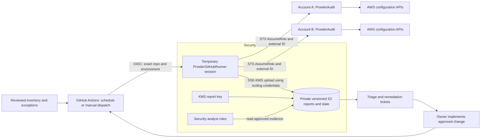

# Automated AWS Multi Account Security and Compliance Assessment Platform

A reference implementation for scheduled, centrally governed AWS security assessments with Prowler, Terraform, and GitHub Actions. A dedicated security tooling account controls cross-account access and stores assessment evidence. Workload accounts expose narrowly trusted audit roles; GitHub authenticates with OIDC and temporary credentials. The host assumes each member role first, and only member audit credentials enter the scanner container.

**Implementation status:** infrastructure and automation are provided for review and deployment. No AWS deployment or live organization scan is claimed. Example account IDs are disabled. This project supports commercial AWS partitions and an explicitly approved account/region inventory.

Canonical repository: [amahjoshdevsec/aws-security-assessment-platform](https://github.com/amahjoshdevsec/aws-security-assessment-platform). See [provenance and attribution](docs/attribution.md) for the upstream walkthrough and retained license.

## Why this project

The original repository demonstrated a local Prowler Docker server against one AWS account. This project extends that learning into repeatable multi-account assessments, accountable exceptions, private reporting, and evidence-based remediation. The [original local-server lab](examples/local-server/README.md), scripts, Terraform, troubleshooting notes, and historical findings remain available for learning. Its access-key provisioning and tenant-wide mutelist are **not** the enterprise deployment path.

## Architecture



Prowler executes on an ephemeral GitHub-hosted Linux runner. The tooling account is the identity and evidence control plane; it does not host persistent scan compute. Each account/region receives an isolated matrix job. Member roles cannot write central reports, and the tooling role cannot change workload resources. Existing SCPs, boundaries, resource policies, and disabled regions can still restrict coverage.

## Capabilities

| Area | Implemented behavior |
| --- | --- |
| Identity | Exact repository/environment OIDC trust; explicit member-role allowlist; exact tooling principal and external ID in member trust |
| Infrastructure | Separate Terraform roots for tooling and each member; account guardrails; no enterprise IAM users/access keys |
| Scheduling | Daily at 03:23 UTC plus manual dispatch from `main`; up to four account/region jobs; no overlapping workflow runs |
| Reproducibility | Prowler 5.38.0 image digest, pinned action commits, AWS provider locks, report checksums and source commit |
| Reporting | Private S3, SSE-KMS, TLS enforcement, public access blocked, bucket owner enforced, versioning and retention |
| Exceptions | Exact account/check/region/resource, independent approver, ticket, evidence/rationale, compensating control, maximum 90-day lifetime |
| Findings | Stable identity; open, risk accepted, resolved, reopened, needs review, and not observed states |
| Remediation | Explicit unmuted PASS from the requested scan required to validate closure |
| Compliance | Prowler native framework mappings retained in CSV/OCSF and normalized output; evidence limitations documented |
| Failure handling | Nonzero operational exit, error logs, invalid/empty reports, or failed uploads fail the job; previous state is preserved |

## Repository layout

```text
.github/workflows/        Credential-free validation and scheduled assessment
config/accounts.json     Approved accounts, owners, role names and regions
config/exceptions.json   Active risk acceptances (empty by default)
scripts/                 Governance, scan execution, normalization and validation
tests/                   Offline behavior and failure-path tests
terraform/security-tooling/  OIDC role, report bucket, KMS, reader grants
terraform/member-account/   Audit role deployed separately to each member
terraform/policies/         Reviewed supplementary scan permissions
docs/                       Deployment, governance and operating procedures
examples/local-server/      Preserved single-account Docker lab
```

## Quick start

### 1. Validate locally

Install Python 3.12+, Terraform 1.7+, Docker, and AWS CLI v2. Python platform scripts use only the standard library. Provider initialization needs network access; subsequent validation does not require AWS credentials.

```bash
git clone https://github.com/amahjoshdevsec/aws-security-assessment-platform.git
cd aws-security-assessment-platform
make test
make tf-init
make tf-check
```

`make matrix` deliberately fails until an account is enabled. Validation does not execute scans, apply Terraform, or start the legacy server.

### 2. Provision the identity and evidence plane

Follow [Terraform deployment](docs/terraform.md). Bootstrap tooling first, then deploy the member root separately under each account's provisioning identity. Use independently secured remote state for each root/account. Review plans before apply. Do not reuse the original local-server Terraform state for these roots.

The enterprise additions policy is derived from the preserved 5.38.0 policy with `securityhub:BatchImportFindings` removed. The platform does not enable Prowler fixers or Security Hub writes. Read permissions can still expose sensitive configuration and logs; audit the policies and restrict report access accordingly.

### 3. Configure GitHub protection and variables

Create the `security-scans` GitHub environment. Restrict deployments to `main` **before granting it AWS trust**. Configure reviewers according to operating policy; required environment reviewers will pause scheduled scans until approval. Protect `main`, require `Validate platform`, require CODEOWNER review, and replace the bootstrap owner with actual security/platform teams. Protect workflow files, inventory, exceptions, image pins and Terraform through the same review path.

Set these environment variables in GitHub Settings → Environments → `security-scans`:

| Variable | Value |
| --- | --- |
| `AWS_TOOLING_ACCOUNT_ID` | Tooling account ID |
| `AWS_TOOLING_ROLE_ARN` | Terraform `github_role_arn` output |
| `AWS_REPORT_REGION` | Region containing the report bucket and KMS key |
| `REPORT_BUCKET` | Terraform `report_bucket` output |
| `REPORT_KMS_KEY_ARN` | Terraform `report_kms_key_arn` output |

No AWS access-key secrets are required. The OIDC subject contains an environment rather than a branch; environment deployment restrictions are part of the security boundary. The workflow additionally refuses scan execution outside `main`. [GitHub documents this trust model](https://docs.github.com/en/actions/how-tos/secure-your-work/security-harden-deployments/oidc-in-aws).

### 4. Approve scope and run a canary

Replace example IDs and external IDs in [accounts.json](config/accounts.json), choose every in-scope region, assign owners, and enable one nonproduction account first. Tooling Terraform’s `member_accounts` map, member trust, and inventory must agree on each account’s role name, path and external ID. Generate the map from inventory as documented in the deployment guide. The external ID is an identifier, not a secret.

Merge reviewed configuration, then use Actions → Scheduled multi-account assessment → Run workflow on `main`. Confirm the complete manifest, raw reports, and state in S3 before expanding scope. The daily schedule is best-effort GitHub scheduling, not a guaranteed delivery SLA. Configure an external stale-evidence alert as described in the [operations guide](docs/operations.md).

### 5. Review evidence and validate remediation

```text
s3://REPORT_BUCKET/
  reports/ACCOUNT/REGION/RUN_ID/
    prowler.csv              Native findings, including PASS and muted rows
    prowler.ocsf.json         Native structured security findings
    prowler.html              Human-readable report
    compliance/              Native framework exports when produced by Prowler
    normalized.json          Stable identities and native mapping text
    state.json               Lifecycle snapshot for this scan
    manifest.json            Health, provenance, counts and SHA-256 hashes
    accounts.json, exceptions.json, mutelist.yaml, errors.log, scan.log
  state/ACCOUNT/REGION/latest.json
```

Reports are sensitive. They are never uploaded as public GitHub Actions artifacts or committed. Authorized analysts retrieve evidence using their own role. After the workload owner deploys an approved fix, dispatch a new scan and verify its lifecycle state:

```bash
aws s3 cp s3://YOUR_BUCKET/state/111111111111/us-east-1/latest.json ./reports/latest.json
python3 scripts/findings.py ./reports/latest.json FINDING_SHA256 RUN_ID
```

Create `reports/` first if needed. A failed check is assessment data, not a failed scanner: Prowler exit `3` is accepted only with healthy output. Access errors, absent evidence, and suppression never count as remediation. See [findings lifecycle](docs/findings-lifecycle.md).

## Governance and compliance

[Exception governance](docs/mutelists.md) defines time limits and independent approvals. No single-account historical exception is inherited by the enterprise inventory. An expired exception fails validation and blocks scanning until removed or reapproved; it never silently remains active. Monitor stale evidence during that interruption.

[Compliance mapping](docs/compliance.md) explains the distinction between automated control evidence and an organization's compliance conclusion. Preserve the framework version, scanner version, assessed scope, control owner, and manual evidence. A high pass percentage cannot establish certification or fill coverage gaps.

## Operating boundaries

- A scan container has a 40-minute limit inside a 55-minute job. Role chaining uses a 3,600-second session. Split large accounts by region and investigate timeouts; increasing the chained role lifetime beyond one hour will not solve them.
- Explicit inventory avoids unreviewed organization-wide onboarding. Account discovery, automatic StackSets enrollment, Security Hub ingestion, ticket creation, dashboards and automatic remediation are extension points, not implemented integrations.
- S3 versioning and checksums support auditability but are not immutable storage. This baseline does not configure Object Lock, replication, bucket access logging, CloudTrail data events, or an independent audit account. Add these through your organization's evidence policy before relying on regulated retention.
- Scan health gates detect logged errors and malformed outputs, but cannot prove every AWS resource was observed. Monitor drift in enabled regions, check counts, APIs and permissions alongside reports.
- GitHub-hosted runners require API connectivity. For private endpoint requirements, move to ephemeral isolated runners; avoid persistent shared runners with reusable credentials.

## Guides and validation

- [Architecture and trust boundaries](docs/architecture.md)
- [Terraform deployment and state](docs/terraform.md)
- [Operations, recovery and reporting](docs/operations.md)
- [Governed mutelists](docs/mutelists.md)
- [Findings lifecycle and remediation](docs/findings-lifecycle.md)
- [Compliance mapping and evidence](docs/compliance.md)
- [Validation and CI](docs/validation.md)
- [Two-account canary validation](docs/canary.md)
- [Migration from the local walkthrough](docs/migration.md)

Licensed under the existing [PolyForm Noncommercial License 1.0.0](LICENSE). Commercial use requires prior written authorization from The DevSec Blueprint LLC, as stated in the license.
