# Deployment and Remediation Walkthrough

This walkthrough demonstrates the **Automated AWS Multi Account Security and Compliance Assessment Platform** in a two-account AWS lab.

It follows a security finding from detection through infrastructure remediation and reassessment.

## What this walkthrough demonstrates

- GitHub Actions authentication to AWS using OIDC.
- Cross-account assessment through a dedicated audit role.
- Centralized assessment evidence in Amazon S3.
- Verification of KMS encryption on an evidence object.
- Detection of a controlled S3 versioning issue.
- Remediation through Terraform.
- Validation using the same finding identity across assessments.

A successful workflow indicates that the assessment completed within its declared coverage. It does not mean all security checks passed.

See the [README](../README.md) for architecture and deployment instructions and the [canary guide](canary.md) for the broader validation checklist.

## Lab architecture

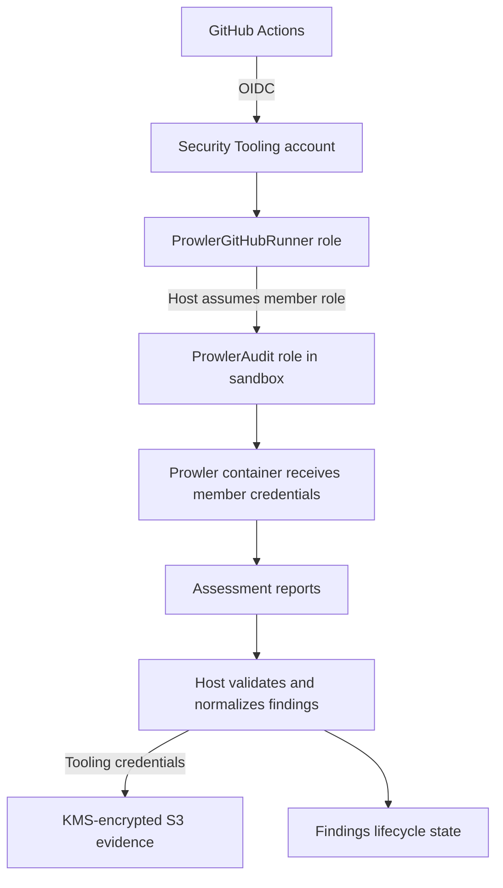

The runner host retains the tooling credentials. The scanner container receives temporary member-account credentials.

## Assessment scope and limitations

This is a two-account lab validation, not evidence of a production organization-wide rollout.

The demonstrated configuration records these coverage exclusions:

- Glue in the designated sandbox account and region.
- One legacy KMS key whose metadata cannot be read by the audit role.
- The Shodan-dependent `ec2_elastic_ip_shodan` check.

Assessments using the sandbox exclusions report `complete_with_exclusions` when the remaining collection and validation steps succeed.

An excluded resource is not evidence of compliance. A disappeared finding is not automatically considered remediated.

## Evidence register

| Item | Value |
| --- | --- |
| Security Tooling account | `323843735194` |
| Sandbox account | `214745599312` |
| Scan region | `us-east-1` |
| Report bucket | `amah-security-report-bucket-us-east-1` |
| Canary bucket | `amah-prowler-canary-04ed63136a86f53933e093ee77` |
| Baseline scan | `37642736431-1` |
| Post-remediation scan selected for validation | `37657180004-1` |
| Check | `s3_bucket_object_versioning` |
| Finding ID | `e777a046a40af1fda6f71dde8ffca82c919fb2cf7fc791ef1eadf63c053ee1c5` |

Baseline evidence confirms an unmuted, observed `FAIL` with lifecycle `open`.

**Final remediation validation: pending confirmation of the commands in Step 8.**

## Prerequisites

The following must already be configured:

- Terraform deployed in the tooling and sandbox accounts.
- GitHub OIDC trust and the protected assessment environment.
- Cross-account `ProwlerAudit` access.
- An enabled sandbox account and region in the assessment inventory.
- GitHub workflow variables for the report bucket, encryption key, and runner role.
- AWS CLI profiles named `security-tooling` and `sandbox`.

Run the commands below from the repository root.

```bash
mkdir -p reports/canary
mkdir -p docs/images/walkthrough
```

If a profile’s SSO session has expired:

```bash
aws sso login --profile security-tooling
aws sso login --profile sandbox
```

## 1. Create a controlled test resource

The canary is an empty, private sandbox bucket. It is separate from the report bucket and Terraform state storage.

The initial configuration in `terraform/member-account/canary.tf` is:

```hcl
resource "aws_s3_bucket" "remediation_canary" {
  bucket_prefix = "amah-prowler-canary-"

  tags = {
    Name    = "Prowler remediation canary"
    Purpose = "Controlled versioning remediation test"
  }
}

resource "aws_s3_bucket_public_access_block" "remediation_canary" {
  bucket = aws_s3_bucket.remediation_canary.id

  block_public_acls       = true
  block_public_policy     = true
  ignore_public_acls      = true
  restrict_public_buckets = true
}

resource "aws_s3_bucket_server_side_encryption_configuration" "remediation_canary" {
  bucket = aws_s3_bucket.remediation_canary.id

  rule {
    apply_server_side_encryption_by_default {
      sse_algorithm = "AES256"
    }
  }
}

output "canary_bucket_name" {
  value = aws_s3_bucket.remediation_canary.id
}
```

Versioning is initially left unconfigured to create the controlled finding. The bucket remains empty, encrypted, and blocked from public access.

For a fresh deployment:

```bash
terraform fmt terraform/member-account

AWS_PROFILE=sandbox \
terraform -chdir=terraform/member-account plan \
  -out=canary.tfplan
```

Review the plan, then apply it:

```bash
AWS_PROFILE=sandbox \
terraform -chdir=terraform/member-account apply canary.tfplan
```

The recorded deployment created three resources and returned:

```text
canary_bucket_name = "amah-prowler-canary-04ed63136a86f53933e093ee77"
```

The name will differ when reproducing this exercise.

## 2. Run the baseline assessment

In GitHub:

1. Open **Actions**.
2. Select **Scheduled multi-account assessment**.
3. Select **Run workflow**.
4. Choose `main`.
5. Start the run and complete any configured environment approval.
6. Wait for the assessment to finish.

The baseline for this exercise is:

[Baseline assessment run](https://github.com/amahjoshdevsec/aws-security-assessment-platform/actions/runs/37642736431)

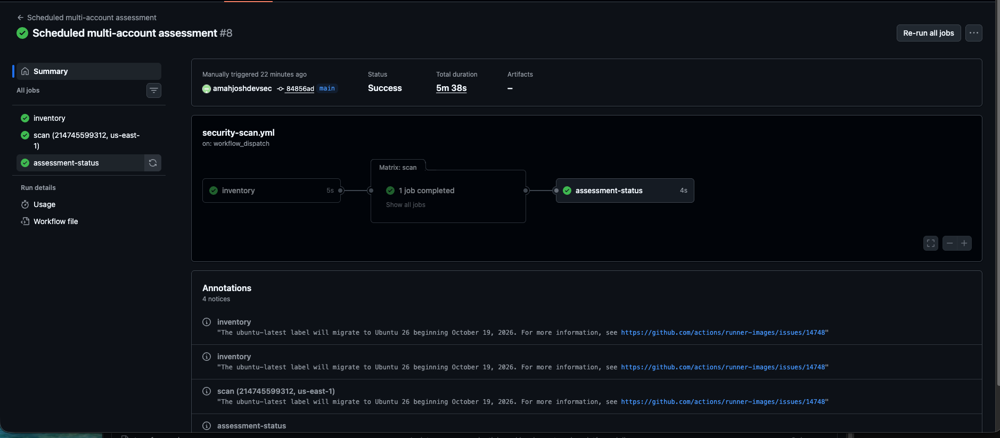

The workflow obtains tooling credentials, assumes the sandbox audit role, executes Prowler, and publishes private evidence.

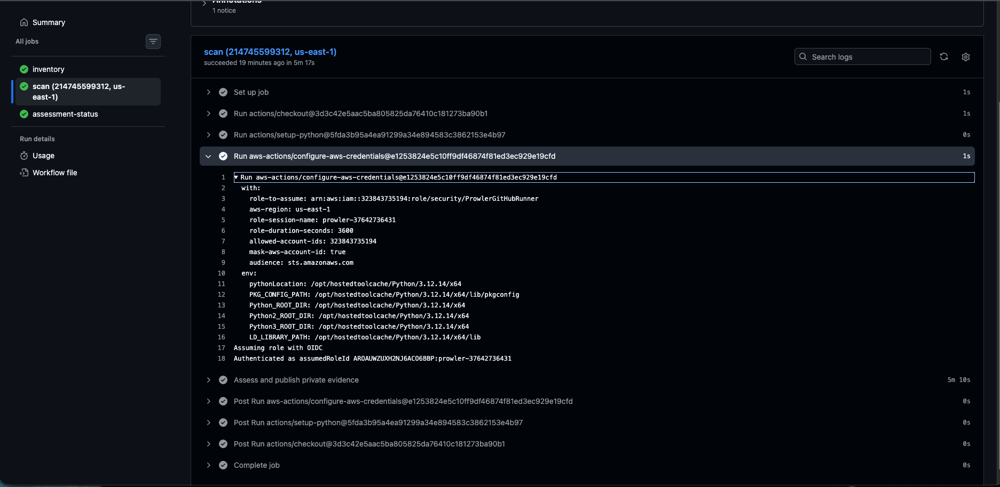

The authentication step demonstrates GitHub obtaining AWS credentials. Separate CloudTrail evidence is needed to independently document the subsequent cross-account role assumption.

## 3. Inspect centralized evidence

The baseline evidence prefix is:

```text
s3://amah-security-report-bucket-us-east-1/reports/214745599312/us-east-1/37642736431-1/
```

List its objects:

```bash
aws s3 ls \
  "s3://amah-security-report-bucket-us-east-1/reports/214745599312/us-east-1/37642736431-1/" \
  --profile security-tooling \
  --region us-east-1
```

The evidence includes native reports, the assessment manifest, normalized findings, and lifecycle state.

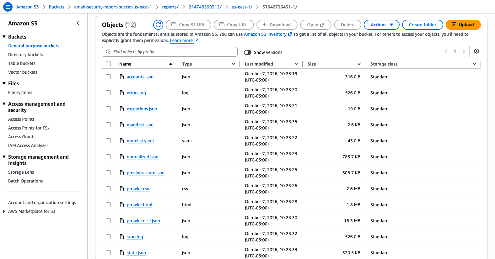

Inspect the manifest:

```bash
aws s3 cp \
  "s3://amah-security-report-bucket-us-east-1/reports/214745599312/us-east-1/37642736431-1/manifest.json" \
  - \
  --profile security-tooling \
  --region us-east-1 \
  --only-show-errors
```

Review the completion status, coverage exclusions, accepted collection errors, finding counts, and report checksums.

## 4. Verify evidence encryption

Inspect the manifest object’s encryption metadata:

```bash
aws s3api head-object \
  --profile security-tooling \
  --region us-east-1 \
  --bucket amah-security-report-bucket-us-east-1 \
  --key reports/214745599312/us-east-1/37642736431-1/manifest.json \
  --query '{Encryption:ServerSideEncryption,KMSKey:SSEKMSKeyId}' \
  --output json \
  --no-cli-pager
```

Expected values:

```json
{
  "Encryption": "aws:kms",
  "KMSKey": "arn:aws:kms:us-east-1:323843735194:key/49c47071-955c-418c-9613-56600a3ae120"
}
```

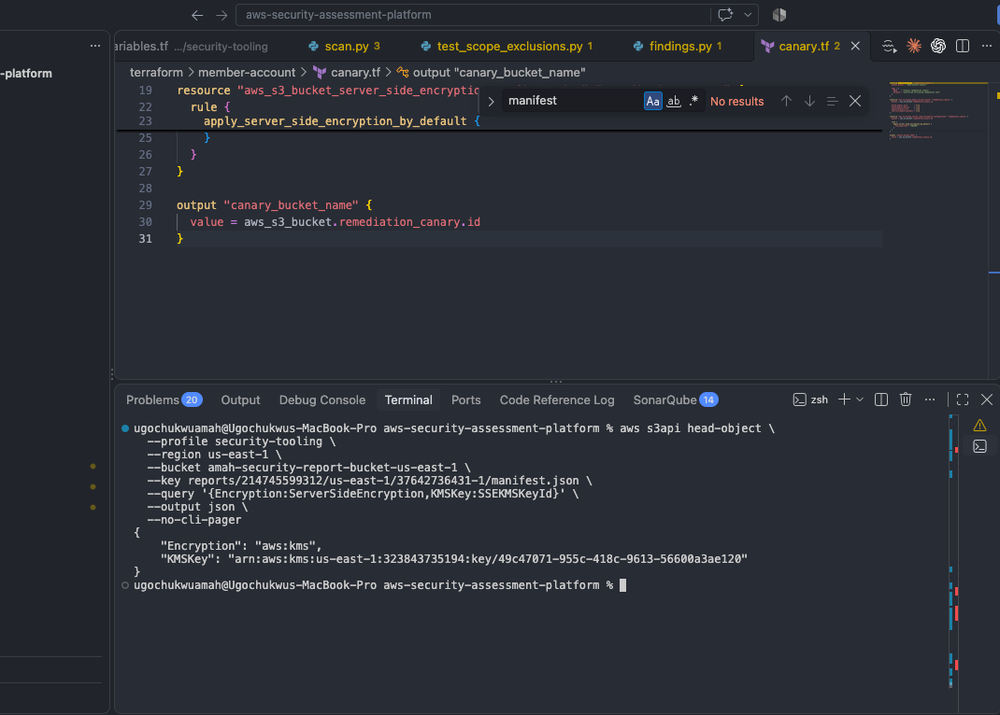

This verifies encryption for the inspected manifest object. It does not independently verify every object in the bucket.

## 5. Record the finding before remediation

Download the baseline lifecycle state:

```bash
aws s3 cp \
  "s3://amah-security-report-bucket-us-east-1/reports/214745599312/us-east-1/37642736431-1/state.json" \
  reports/canary/before-state.json \
  --profile security-tooling \
  --region us-east-1 \
  --only-show-errors
```

Display the canary finding:

```bash
python3 - <<'PY'
import json

finding_id = "e777a046a40af1fda6f71dde8ffca82c919fb2cf7fc791ef1eadf63c053ee1c5"

with open("reports/canary/before-state.json") as file:
    state = json.load(file)

finding = state["findings"][finding_id]

print("CANARY: BEFORE REMEDIATION")
print("Run:", state["run_id"])
print("Check:", finding["check_id"])
print("Resource:", finding["resource"])
print("Finding ID:", finding_id)
print("Status:", finding["status"])
print("Lifecycle:", finding["lifecycle"])
print("Muted:", finding["muted"])
print("Observed:", finding["observed_in_latest"])
PY
```

Recorded baseline result:

```text
Run: 37642736431-1
Status: FAIL
Lifecycle: open
Muted: False
Observed: True
```

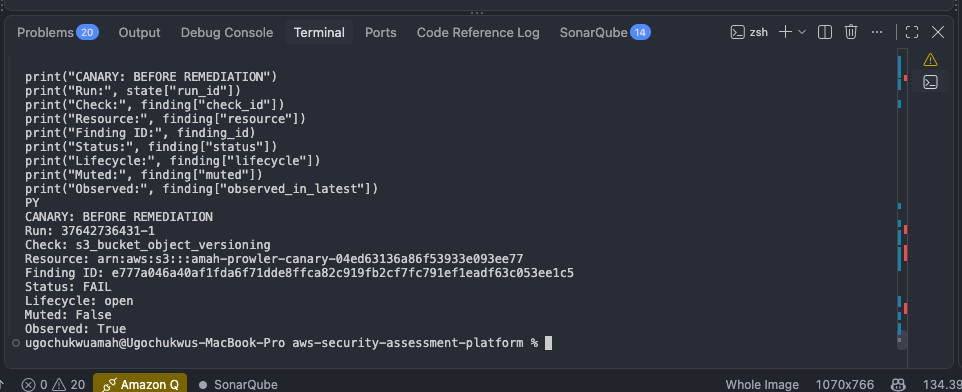

The finding is active and unmuted. Its identity will be used to correlate the later reassessment.

Before remediation, inspect the bucket in **S3 → bucket → Properties → Bucket Versioning**.

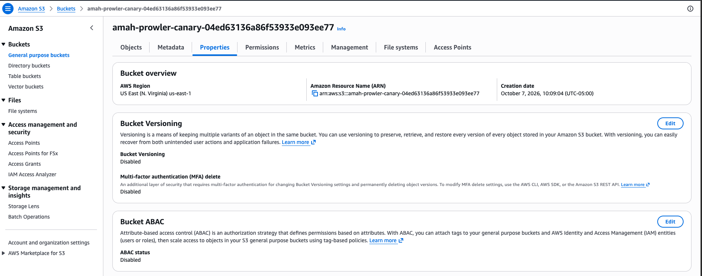

A CLI check is also available:

```bash
aws s3api get-bucket-versioning \
  --bucket amah-prowler-canary-04ed63136a86f53933e093ee77 \
  --profile sandbox \
  --region us-east-1 \
  --output json \
  --no-cli-pager
```

A bucket that has never had versioning enabled normally returns `{}`.

## 6. Remediate through Terraform

Append this resource to `terraform/member-account/canary.tf`:

```hcl
resource "aws_s3_bucket_versioning" "remediation_canary" {
  bucket = aws_s3_bucket.remediation_canary.id

  versioning_configuration {
    status = "Enabled"
  }
}
```

Inspect the change:

```bash
terraform fmt terraform/member-account

git --no-pager diff -- terraform/member-account/canary.tf
```

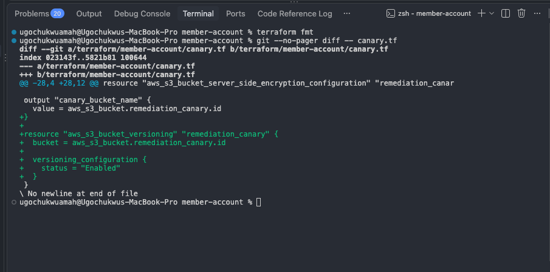

Create the plan:

```bash
AWS_PROFILE=sandbox \
terraform -chdir=terraform/member-account plan \
  -out=canary-versioning.tfplan
```

If versioning is the only pending change, expect one resource addition with no resource changes or destructions. The addition manages versioning on the existing bucket; it does not replace the bucket.

Apply the reviewed plan:

```bash
AWS_PROFILE=sandbox \
terraform -chdir=terraform/member-account apply canary-versioning.tfplan
```

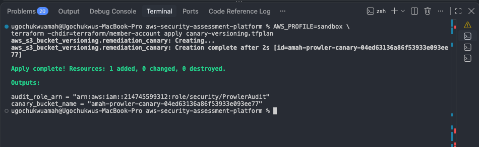

Retain the Terraform change in Git as the implementation record.

## 7. Verify the deployed configuration

Run:

```bash
aws s3api get-bucket-versioning \
  --bucket amah-prowler-canary-04ed63136a86f53933e093ee77 \
  --profile sandbox \
  --region us-east-1 \
  --output json \
  --no-cli-pager
```

Expected result:

```json
{
  "Status": "Enabled"
}
```

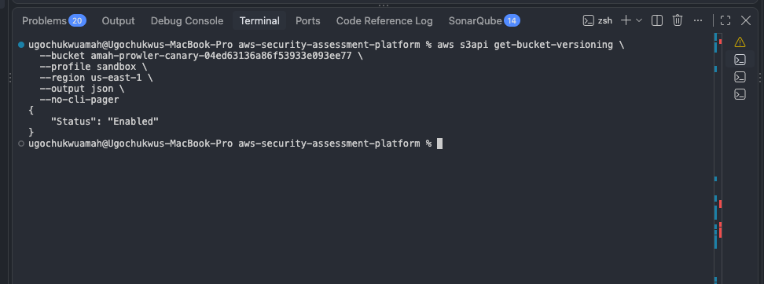

This confirms the configuration change. A new assessment must still verify the security finding.

## 8. Reassess and validate remediation

Start a new **Scheduled multi-account assessment** run on `main`.

The post-remediation run selected for this exercise is:

[Post-remediation assessment run](https://github.com/amahjoshdevsec/aws-security-assessment-platform/actions/runs/37657180004)

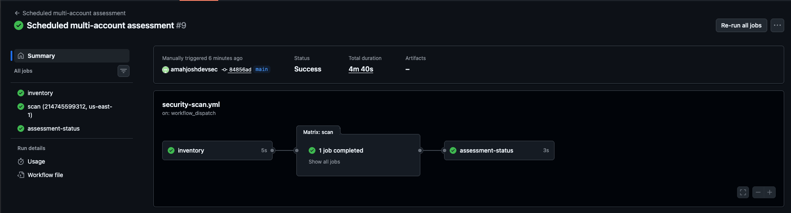

Download its lifecycle state:

```bash
aws s3 cp \
  "s3://amah-security-report-bucket-us-east-1/reports/214745599312/us-east-1/37657180004-1/state.json" \
  reports/canary/after-state.json \
  --profile security-tooling \
  --region us-east-1 \
  --only-show-errors
```

Display the same finding:

```bash
python3 - <<'PY'
import json

finding_id = "e777a046a40af1fda6f71dde8ffca82c919fb2cf7fc791ef1eadf63c053ee1c5"

with open("reports/canary/after-state.json") as file:
    state = json.load(file)

finding = state["findings"][finding_id]

print("CANARY: AFTER REMEDIATION")
print("Run:", state["run_id"])
print("Check:", finding["check_id"])
print("Resource:", finding["resource"])
print("Finding ID:", finding_id)
print("Status:", finding["status"])
print("Lifecycle:", finding["lifecycle"])
print("Muted:", finding["muted"])
print("Observed:", finding["observed_in_latest"])
print("Validation run:", finding.get("validation_run"))
PY
```

The acceptance criteria are:

```text
Run: 37657180004-1
Status: PASS
Lifecycle: resolved
Muted: False
Observed: True
Validation run: 37657180004-1
```

Run the platform’s remediation validator:

```bash
python3 scripts/findings.py \
  reports/canary/after-state.json \
  e777a046a40af1fda6f71dde8ffca82c919fb2cf7fc791ef1eadf63c053ee1c5 \
  37657180004-1
```

Expected output:

```text
Remediation validated
```

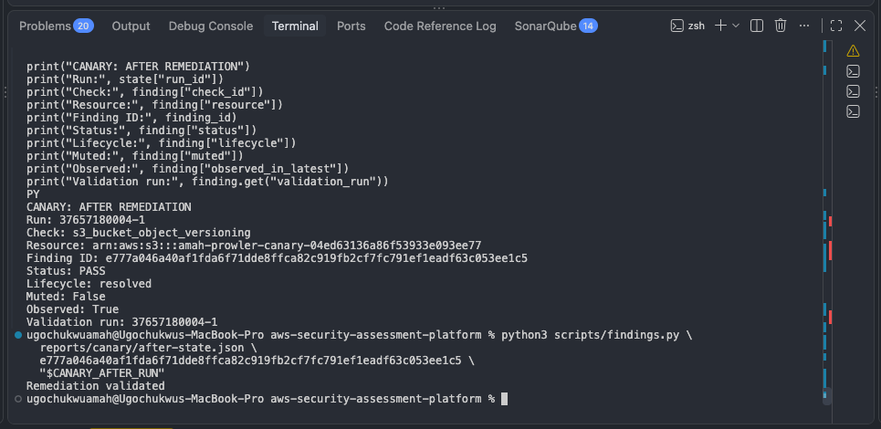

**Record this step as passed only after the actual output confirms these criteria.**

The required transition is:

```text
Baseline:       FAIL → open
Configuration:  versioning enabled through Terraform
Reassessment:  explicit, unmuted PASS → resolved
```

A missing finding, an accepted exception, or a green workflow alone does not meet these remediation criteria.

## Evidence retention and publication

Retain privately:

- Baseline and post-remediation manifests.
- Both lifecycle-state snapshots.
- The finding ID.
- Terraform change and apply details.
- Workflow URLs and timestamps.
- Actual remediation-validator output.
- Relevant CloudTrail events where collected.

Publish reviewed screenshots and a concise account of the observed results. Do not commit credentials, session tokens, Terraform state, saved plans, or raw private assessment reports.

Screenshots illustrate the walkthrough; the retained machine-readable evidence supports the result.

## Cleanup

Keep the canary until the evidence is complete. Then review removal of its Terraform resources and apply that cleanup through the same sandbox configuration.

Retain centralized assessment evidence according to the project’s retention policy.